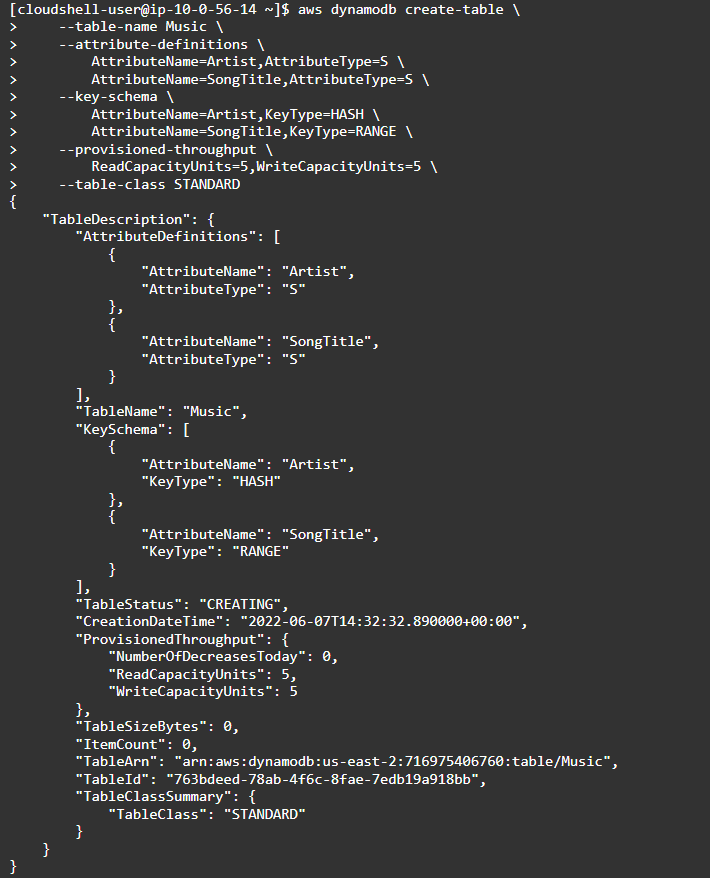

# Music Table

Generally speaking, the data stored in DynamoDB looks like JSON data. It also reminds me of Redis, cuz they both use key-value pairs to store structured data.&#x20;

\--Good Night and commit! Jun 7th.
